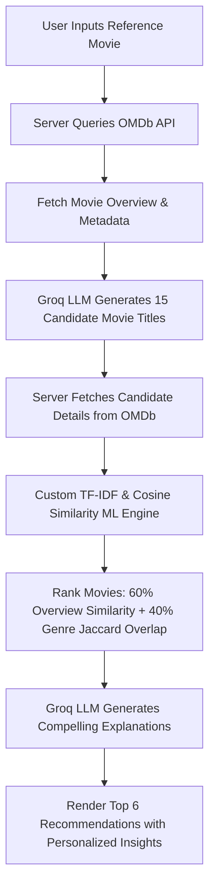

# 🎬 MovieMind AI Pro

MovieMind AI Pro is an intelligent, high-fidelity film discovery and recommendation platform. It combines the power of large language models (LLMs) with custom client-server machine learning pipelines to deliver highly personalized, factually grounded, and contextually rich movie recommendations.

The application features a sleek dark-mode user interface designed with React, Vite, and Tailwind CSS. It is backed by an Express server written in TypeScript, which integrates the **OMDb API** for real-time movie metadata and the **Groq API** (using the `llama-3.3-70b-versatile` model) for intelligent cinematic synthesis.

---

## 🌟 Key Features

*   **Custom ML-Powered Recommendation Pipeline**:
    *   Generates highly relevant candidates based on a reference movie using Groq.
    *   Calculates vector representations of overviews, titles, and genres.
    *   Ranks candidates using a custom TF-IDF and Cosine Similarity engine combined with genre overlap metrics.
    *   Generates dynamic, personalized summaries explaining *why* each movie matches your taste.
*   **AI Movie Assistant**:
    *   A chatbot dedicated to all things cinema.
    *   Converses with deep historical and technical film knowledge.
    *   Leverages real-time OMDb API database lookups to ground descriptions in factual metadata.
*   **Mood-Based Discovery**:
    *   Analyzes your current emotional vibe (Happy, Sad, Romantic, Excited, Motivated).
    *   Synthesizes a tailored list of recommendations fitting that exact atmosphere.
*   **Movie Comparison Engine**:
    *   Perform deep, side-by-side comparative analysis of any two films.
    *   Compares narrative themes, visual styles, cinematography choices, factual/scientific realism, and critical reception.
    *   Generates a final summarizing verdict.
*   **Trailer Insights & Vibe Summary**:
    *   Generates high-impact visual summaries of a film's preview style.
    *   Constructs specific hype checklists detailing cinematic highlights (e.g., soundscapes, cinematography, tension pacing).

---

## 📐 Hybrid ML Recommendation Pipeline

MovieMind AI Pro operates a hybrid recommendation model combining **semantic extraction (LLM)** and **vector distance representation (Machine Learning)**:



### 1. Vector Space Representation (TF-IDF)
For the reference movie and all fetched candidates, the engine computes **Term Frequency-Inverse Document Frequency (TF-IDF)** vectors:
*   **Tokenization**: Strips punctuation, lowercases words, and filters out common English stopwords.
*   **Term Frequency ($TF$)**: Computes normalized occurrence counts of remaining tokens in the movie's title and description. Title and genres are over-indexed (weighted twice) to emphasize structural similarity.
*   **Inverse Document Frequency ($IDF$)**: Measures term rarity across all retrieved candidate documents:
    $$IDF(t) = \ln\left(1 + \frac{N}{DF(t)}\right)$$
*   **Vectorization**: Forms a sparse term-weight mapping where $TF\text{-}IDF = TF \times IDF$.

### 2. Cosine Similarity Calculation
The semantic description match score is computed as the Cosine Similarity between the reference movie vector $\vec{A}$ and candidate vector $\vec{B}$:
$$\text{Cosine Similarity}(\vec{A}, \vec{B}) = \frac{\vec{A} \cdot \vec{B}}{\|\vec{A}\| \|\vec{B}\|} = \frac{\sum_{i} A_i B_i}{\sqrt{\sum_{i} A_i^2} \sqrt{\sum_{i} B_i^2}}$$

### 3. Genre Intersection (Jaccard Similarity)
Categorical overlap is computed using the **Jaccard Similarity Coefficient** over genre sets:
$$J(G_A, G_B) = \frac{|G_A \cap G_B|}{|G_A \cup G_B|}$$

### 4. Composite Match Ranking
The final similarity score ($S$) is weighted heavily toward description semantics, normalized to a percentage range:
$$S = \min\left(\max\left(\text{Round}\left(\left(0.6 \cdot \text{CosineSimilarity} + 0.4 \cdot \text{JaccardSimilarity}\right) \times 100\right), 0\right), 100\right)$$

---

## 🛠️ Technology Stack

*   **Frontend**: React 19 (Hooks, SPA architecture), Vite, Tailwind CSS (Utility classes & custom animations), Lucide React (Icons).
*   **Backend**: Express Server, Node.js, TypeScript compiler (`tsx` for local execution, `esbuild` for production compilation).
*   **AI Models**: Groq Cloud API (`llama-3.3-70b-versatile` text completion model).
*   **Metadata Source**: OMDb (Open Movie Database) REST API.

---

## 📂 Project Structure

```
├── assets/                     # Static media and design resources
├── dist/                       # Compiled production build (Vite + Express Server bundle)
├── src/                        # React Frontend Source Code
│   ├── components/             # Reusable UI components
│   │   ├── AssistantSection    # AI Chat Interface
│   │   ├── CompareSection      # Comparison Tool UI
│   │   ├── Header              # Brand Nav & API Key Status
│   │   ├── MoodSection         # Mood Grid & Recommendation Display
│   │   ├── MovieRecommendations # Recommendations Grid (TF-IDF scores)
│   │   ├── SearchSection       # Autocomplete search bar
│   │   └── TrailerModal        # Detail view / Hype summary overlay
│   ├── lib/
│   │   └── ml.ts               # Custom TF-IDF, Cosine Similarity & Jaccard logic
│   ├── App.tsx                 # Main application structure and state router
│   ├── index.css               # Tailwind imports and animations
│   ├── main.tsx                # Client bundle mount point
│   └── types.ts                # TypeScript interfaces and type definitions
├── server.ts                   # Express server config, APIs, & middleware endpoints
├── package.json                # Project dependencies and build scripts
├── tsconfig.json               # TypeScript rules
├── vite.config.ts              # Vite configuration (aliases, HMR, plugins)
└── .env                        # Environment Configuration (API keys)
```

---

## 🚀 Installation & Local Setup

### Prerequisites
*   Node.js (v18 or higher recommended)
*   An active **OMDb API Key** (Get one free or paid [here](http://www.omdbapi.com/apikey.aspx))
*   An active **Groq API Key** (Generate one [here](https://console.groq.com/keys))

### Steps

1.  **Clone or Open the Project**:
    Navigate to your workspace directory.

2.  **Install Dependencies**:
    ```bash
    npm install
    ```

3.  **Configure Environment Variables**:
    Create a `.env` file in the root directory (or edit the one generated for you):
    ```env
    OMDB_API_KEY="your_omdb_api_key_here"
    GROQ_API_KEY="your_groq_api_key_here"
    ```

4.  **Run Development Server**:
    Start the local development pipeline:
    ```bash
    npm run dev
    ```
    Open your browser and visit: [http://localhost:3000](http://localhost:3000)

5.  **Compile & Launch Production Build**:
    ```bash
    npm run build
    npm start
    ```

---

## 🔌 API Endpoints Reference

| Method | Endpoint | Description |
| :--- | :--- | :--- |
| `GET` | `/api/config` | Verifies whether valid API keys are configured on the host machine. |
| `GET` | `/api/search` | Retrieves movie suggestions matching autocomplete input via OMDb query parameters. |
| `POST` | `/api/recommend` | Runs the hybrid ML TF-IDF recommendation pipeline for a given base movie. |
| `POST` | `/api/mood` | Instructs Groq to recommend 6 movies matching a specified emotional mood. |
| `POST` | `/api/chat` | Sends message histories to the assistant model, injected with real-time OMDb context. |
| `POST` | `/api/compare` | Synthesizes a structured JSON comparison detailing differences between two films. |
| `POST` | `/api/trailer-summary` | Generates genre summaries and feature lists representing movie trailer atmospheres. |

---

## 📄 License

This project is licensed under the Apache-2.0 License. See the [LICENSE](LICENSE) file for more information (if applicable).
